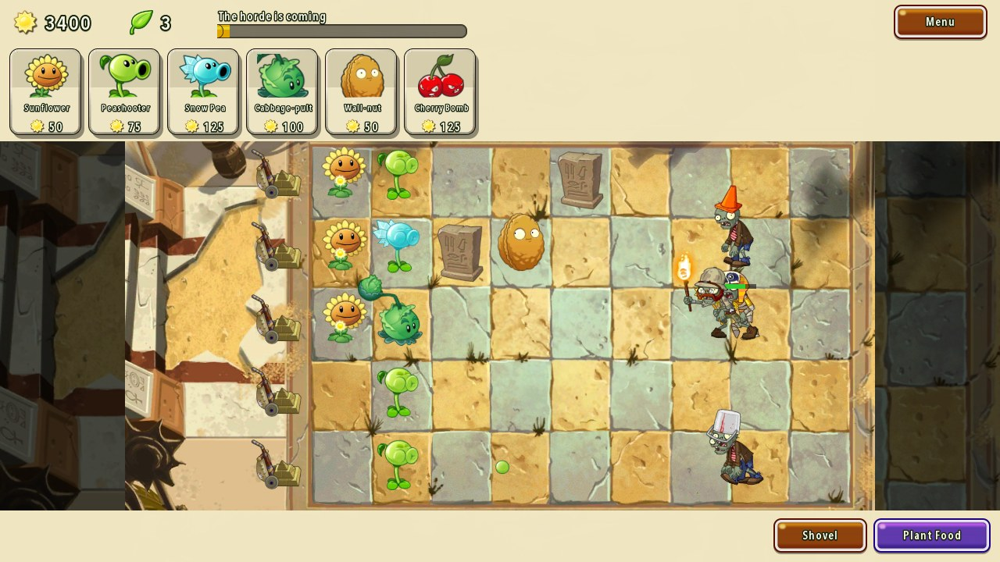
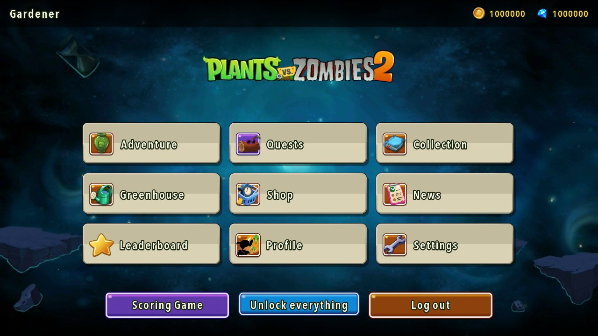
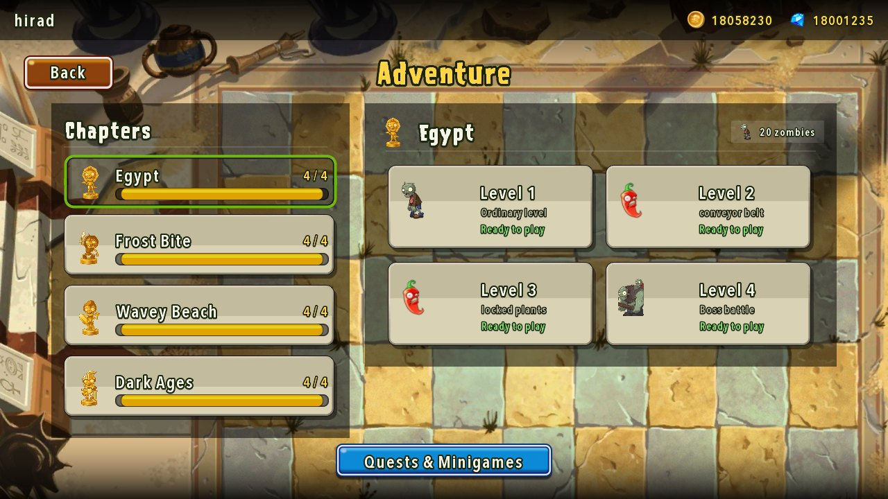
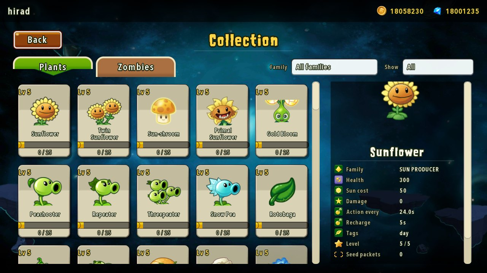
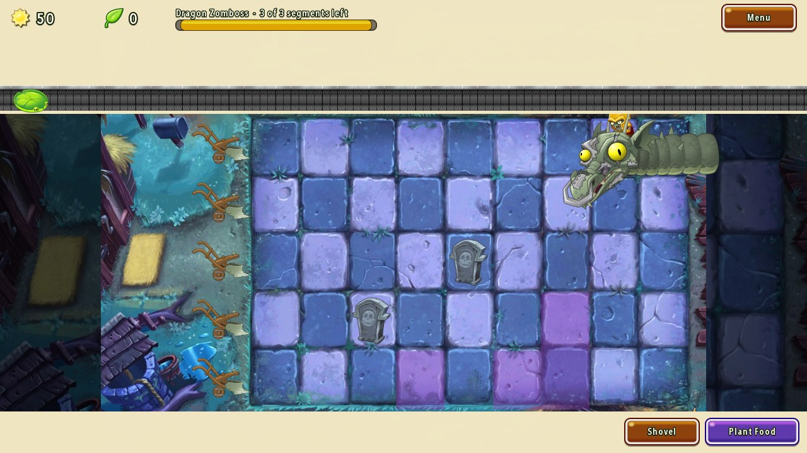

<div align="center">

# 🌻 Plants vs. Zombies 2 — Group 33

**A full remake of PopCap's lawn defence, built from scratch in Java with libGDX.**

Four chapters · 69 plants · 38 zombies · 4 Zomboss fights · 6 minigames · every frame driven by the game's original PAM animations.

[](https://openjdk.org/projects/jdk/21/)
[](https://libgdx.com/)
[](https://gradle.org/)
[](config/checkstyle/checkstyle.xml)
[](config/pmd/ruleset.xml)

*Advanced Programming — Sharif University of Technology*

</div>

---

<div align="center">

</div>

---

## Table of Contents

**Part I — The Game**
[Screenshots](#screenshots) ·
[Quick Start](#quick-start) ·
[Controls](#controls) ·
[What's In It](#whats-in-it) ·
[The Adventure](#the-adventure) ·
[Boss Fights](#boss-fights) ·
[Minigames](#minigames) ·
[Between Battles](#between-battles)

**Part II — The Code**
[Architecture](#architecture) ·
[The Graphics Pipeline](#the-graphics-pipeline) ·
[Build & Code Quality](#build--code-quality) ·
[How We Verified It](#how-we-verified-it) ·
[Data & Persistence](#data--persistence)

**Part III — Reference**
[The Parked CLI](#the-parked-command-line-build-legacy-cli) ·
[Command Reference](#general-menu-rules) ·
[Design Decisions](#design-decisions-left-to-us) ·
[Cheats](#cheat-commands)

---

## Team

| Full Name | Student ID |
|-----------|------------|
| AmirHossein Yousefi | 404106571 |
| Kamyar Haghighatdoost | 404105778 |
| Hirad Sirati | 404105961 |

---

# Part I — The Game

## Screenshots

<table>
<tr>
<td width="50%"><br><sub><b>Main menu</b> — every screen shares one animated backdrop, a gold-trimmed panel skin and a persistent currency bar.</sub></td>
<td width="50%"><br><sub><b>Adventure map</b> — four chapters, progress bars, per-level cards that name the special rule waiting inside.</sub></td>
</tr>
<tr>
<td width="50%"><br><sub><b>Almanac</b> — all 69 plants and 38 zombies with live animated portraits, stats, family filters and a seen/unseen gate.</sub></td>
<td width="50%"><br><sub><b>Dragon Zomboss</b> — a two-lane boss with a segmented health bar, its own move set and burning tiles.</sub></td>
</tr>
</table>

---

## Quick Start

You need **JDK 21**. Nothing else — Gradle fetches the rest.

```bash
./gradlew :lwjgl3:run          # Linux / macOS
gradlew.bat :lwjgl3:run        # Windows
```

**First run:** create an account on the sign-up screen, pick a security question, log in.
In a hurry? The main menu has an **Unlock everything** button that opens all chapters,
levels and plants at max level, and tops up your wallet.

**Packaging a jar:**

```bash
./gradlew :lwjgl3:jar          # -> lwjgl3/build/libs/group-33-1.0.jar
```

**In IntelliJ:** open the repo root as a **Gradle** project, then run `Lwjgl3Launcher`.

---

## Controls

Everything is mouse-driven; the keyboard is for shortcuts.

| Input | Does |
|-------|------|
| **Left click** a seed packet | Pick that plant up — the cursor becomes the plant and the lawn highlights legal tiles |
| **Left click** a lawn tile | Plant it (green tint = legal, red = blocked, occupied or unaffordable) |
| **Left click** a falling sun | Collect it |
| **Left click** a glowing plant | Pick up the plant food it dropped |
| **Shovel** button, then a plant | Dig it up |
| **Plant Food** button, then a plant | Supercharge it — every plant has its own plant-food effect |
| **Esc** | Pause menu in battle · back one screen in the menus |
| **F11** or **Alt + Enter** | Toggle fullscreen, from anywhere |

Fullscreen is also a checkbox in **Settings**, and it is remembered per account — the
game comes back up the way you left it. The viewport letterboxes cleanly at any aspect
ratio, ultrawide included.

---

## What's In It

<table>
<tr>
<td align="center"><b>69</b><br><sub>plants</sub></td>
<td align="center"><b>38</b><br><sub>zombies</sub></td>
<td align="center"><b>4</b><br><sub>chapters</sub></td>
<td align="center"><b>16</b><br><sub>levels</sub></td>
<td align="center"><b>8</b><br><sub>special level types</sub></td>
<td align="center"><b>6</b><br><sub>minigames</sub></td>
<td align="center"><b>4</b><br><sub>Zomboss fights</sub></td>
<td align="center"><b>14</b><br><sub>screens</sub></td>
</tr>
</table>

Every plant does something distinct — not just "shoots faster". Shooters lead their
targets with real projectiles, lobbers arc over wall-nuts and graves, melee plants have
reach, traps arm on a timer, and instant plants detonate the moment they touch the lawn.
Torchwood ignites peas that pass through it. Magnet-shroom strips metal armour and
ignores traffic cones. Umbrella zombies shelter everyone beside them from lobbed shots.
Snorkel zombies dive and surface as a ripple on the water.

---

## The Adventure

Four chapters, four levels each, unlocked in order. Every chapter changes the rules of
the lawn, not just the wallpaper.

| Chapter | L1 | L2 | L3 | L4 | The lawn itself |
|---------|----|----|----|----|-----------------|
| 🏜️ **Egypt** | Ordinary | Conveyor Belt | Locked Plants | 🤖 **Robot Zomboss** | Gravestones block straight shots; a sandstorm hurls zombies forward on the last wave |
| ❄️ **Frost Bite** | Ordinary | Save Our Seeds | Timed War | 🦣 **Mammoth Zomboss** | Icy winds freeze plants in stages; slider tiles shove zombies between lanes; zombies arrive frozen in ice |
| 🏖️ **Wavey Beach** | Ordinary | Dead Line | Love Your Plants | 🦈 **Shark Zomboss** | The tide advances and retreats every wave, drowning land plants and exposing low-tide shallows that zombies climb out of |
| 🌑 **Dark Ages** | Ordinary | Night Ops | Plant What You Get | 🐉 **Dragon Zomboss** | No sky sun; graves rise every wave and necromancy raises the dead out of them |

All eight special level types from the course document are implemented and each appears
at least once: **Conveyor Belt**, **Locked Plants**, **Save Our Seeds**, **Timed War**,
**Night Ops**, **Dead Line**, **Love Your Plants**, **Plant What You Get**.
See [Design Decisions](#special-levels) for the exact rule we gave each one.

---

## Boss Fights

Each chapter ends with a **Zomboss** — a two-lane monster with a segmented health bar,
its own animation set, and a move list drawn from the document.

| Boss | Moves |
|------|-------|
| 🐉 **Dragon** | Fireballs that scorch a tile for 4s and leave a Dragon Imp · sets both its rows ablaze · summons |
| 🤖 **Robot** | Rocket strike that throws up two graves · charges forward and flattens its rows · summons through a portal |
| 🦣 **Mammoth** | Ice missile · icy wind down two rows · freezes a whole column solid. Never moves, never summons |
| 🦈 **Shark** | Spits baby sharks that swallow water plants · turbine that inhales everything in front of it |

Clear a health segment and the boss reels back, stunned and vulnerable. It slides
smoothly between lane pairs, plays a different clip for every move, and — unlike every
other zombie — it cannot be mown down by a lawnmower or hypnotised off the board.

---

## Minigames

Reachable from **Quests & Minigames**, each with three difficulty tiers.

| Minigame | The twist |
|----------|-----------|
| 🏺 **Vasebreaker** | Break vases blind — some hide zombies, some hide seed packets that fade if you dawdle |
| 🎳 **Wall-nut Bowling** | Bowl nuts from behind the red line; they ricochet diagonally off each zombie they flatten |
| 🧟 **I, Zombie** | You play the horde — buy zombies with sun and eat five brains through a pre-built garden |
| 💎 **Beghouled** | Match three plants to clear them, bank combos, buy upgrades, and survive the trickle of zombies |
| 🌱 **Zombotany** | Zombies wearing plant heads: peashooter zombies snipe your defences, jalapeño zombies torch a lane |
| 🏆 **Scoring Game** | An endless run scored on five patterns — multi-kills, speed kills, mass kills, streaks and untouched mowers |

---

## Between Battles

| Screen | What it's for |
|--------|---------------|
| **Almanac** | Every plant and zombie, animated, with full stats. Zombies stay silhouetted until you meet them |
| **Greenhouse** | Twelve pots on real timers. Marigolds pay coins; other plants bank a free plant-food boost for your next level |
| **Shop** | Pots, plant food, seed bundles, currency exchange, and a date-seeded daily offer at 20% off |
| **Travel Log** | 20 quests across critical / high / daily pages, with live progress bars and real payouts |
| **Leaderboard** | Sortable by miopoint score, minigames won, quests done or levels cleared |
| **Profile** | Rename, re-email, change password, and see your run totals |
| **Settings** | Difficulty, game speed, music and SFX volume, lawn grid overlay, fullscreen, debug mode |
| **News** | Everything the game wants to tell you: new zombies met, levels unlocked, chapters cleared |

---

# Part II — The Code

## Architecture

A Gradle multi-module build. `core` holds every rule and every pixel; `lwjgl3` is a
thirty-line launcher. The logic layer knows nothing about libGDX-the-backend, so the
same rules already drive two different front-ends — the graphical game and the parked CLI.

```
group-33/
├── core/                       everything: rules + rendering
│   └── src/main/java/
│       ├── models/             the game's nouns — no behaviour that needs a controller
│       │   ├── entities/       PlantType (69) · ZombieType (38) · armour decorators
│       │   ├── game/           GameSession · PlacedPlant · Projectile · Sun · ScoreTracker
│       │   ├── map/            Grid · Tile · TerrainType
│       │   ├── progress/       Chapter → Level → SpecialLevel / BossLevel
│       │   ├── quest/ shop/ user/ settings/
│       │   └── enums/regexes/  every command pattern, one enum per menu
│       ├── controllers/
│       │   ├── managers/       the tick loop: Combat · ZombieBehavior · Planting ·
│       │   │                   Wave · Sun · Projectile · Minigame · Zomboss ·
│       │   │                   ChapterEnvironment · PlantFoodEffects · ShotPatterns
│       │   └── menuControllers/ one controller per screen
│       ├── views/
│       │   ├── screens/        14 scene2d screens
│       │   ├── battle/         LawnView · EntityAnimator · Lawn · ConveyorBar · Dialogue
│       │   ├── assets/         Art · Animations · AnimationCatalog · Audio
│       │   └── ui/             skin, reusable widgets, Display (fullscreen)
│       ├── database/           flat-file DAOs
│       └── utils/              FileStore · UserDataStore · SessionStore · PasswordHasher
├── lwjgl3/                     desktop launcher (LWJGL3 backend)
├── assets/                     3 030 tracked files — atlases, PAM animations, skin, data
├── tools/build_atlases.py      turns the game's RESOURCES.json into libGDX atlases
├── config/                     Checkstyle + PMD rulesets
├── docs/screenshots/           the images in this README
└── legacy-cli/                 the phase-1 CLI, parked but intact
```

**The tick loop.** The model runs on a fixed clock: `GameSession.TICKS_PER_SECOND = 10`.
`BattleScreen` accumulates real frame time, converts it into whole ticks (scaled by the
player's game-speed setting, capped per frame so a stutter can't fast-forward the game),
and calls `session.advanceTime(1)` for each one. The renderer interpolates between ticks,
so the game logic stays deterministic and testable while the picture stays smooth.

**Why the view never guesses.** `LawnView` watches the model rather than being told what
to draw. It diffs health to flash damage, diffs cooldowns to trigger attack clips, diffs
positions to spawn storms, diffs the plant list to puff a cloud of dirt where something
was just planted, and diffs the zombie list to lay down a corpse — or a pile of ash, if a
blast went off nearby. No controller ever calls a view method.

---

## The Graphics Pipeline

There are no sprite sheets in this project. Everything is rendered from the original
game's own vector animation format.

```
 assets/RESOURCES.json  ──►  tools/build_atlases.py  ──►  780 libGDX .atlas descriptors
                                                            (42 246 regions)
 assets/IMAGES/**.PAM   ──►  libPVZ (PamPlayer)      ──►  1 458 skeletal animations
                                                            resolved by clip name
```

1. **Atlases.** The asset dump ships one giant `RESOURCES.json` plus packed PNGs.
   `tools/build_atlases.py` reads that manifest and emits a libGDX `.atlas` next to every
   page, so `TextureAtlas` can find any of the 42 246 regions by name.

2. **Animations.** `.PAM` is PopCap's skeletal format. We render it with
   [libPVZ](https://github.com/pizpizi/libPVZ), wrapped in `views/assets/Animations` —
   which indexes `animations.json`, caches clip handles and bounds, and degrades to a
   still texture rather than crashing if anything is missing.

3. **Naming.** `AnimationCatalog` is the single map from a game concept to an animation
   and a clip: every plant, every zombie, boss move sets, armour part names for the three
   damage stages, mower per chapter, and the effect library (poof, ash, ripple, splat,
   splash, sandstorm, fire tile…).

4. **Placement.** `EntityAnimator` converts clip bounds into lawn coordinates — one unit
   scale for plants and one for zombies so relative sizes stay honest, plus helpers to
   anchor a sprite by its centre or by its feet. That last one matters: the Dragon
   Zomboss extends 506 units *above* its origin, so anchoring it by the centre buried it
   behind the seed tray.

**Lawn geometry is derived, never hard-coded.** `Lawn.configure()` takes the chapter
background, works out how `Scaling.fill` will letterbox it, and computes the grid from
fractions of the image. One set of numbers aligns plants to the painted tiles in all four
chapters, at any window size.

---

## Build & Code Quality

| Task | What it does |
|------|--------------|
| `./gradlew build` | Compiles every module |
| `./gradlew :lwjgl3:run` | Compiles and starts the game |
| `./gradlew lint` | Runs **Checkstyle + PMD** over `core` |
| `./gradlew :lwjgl3:jar` | Fat jar into `lwjgl3/build/libs/` |

The rulesets in `config/` mirror exactly the Checkstyle and PMD rules named in the course
document: naming conventions, line length ≤ 120, method length ≤ 50, unused imports,
unused locals / fields / methods / parameters, and NCSS counts.

**Current state: Checkstyle reports 0 violations.** PMD reports 2, both the same
`NcssCount` note about `LawnView` and `BattleScreen` being large classes — they are the
renderer and the battle HUD, and we judged splitting working, verified rendering code
purely to satisfy a size metric to be the worse trade. Reports land in
`core/build/reports/{checkstyle,pmd}/main.html`.

The linters run on `core` only; `lwjgl3` is launcher boilerplate.

---

## How We Verified It

Reading code finds the bugs you thought to look for. We wrote throwaway harnesses to
find the rest, ran them against the real game, then deleted them.

| Harness | What it drove | Result |
|---------|---------------|--------|
| **Art audit** | Every one of the 69 plants, 38 zombies and 33 effect animations: does the animation exist, does the clip resolve, are the bounds valid, do the `attack` / `eat` / `die` / ability clips exist, are all three armour damage-stage parts present in the PAM? | Found the one plant with no animation at all |
| **Plant audit** | Planted all 69 plants into a live session and ran 30 seconds: sun producers must produce, attackers must draw blood, walls must survive, mints must release and vanish, Ice-shroom must freeze, Magnet-shroom must strip metal | 0 failures |
| **Zombie audit** | All 38 zombies walking and eating, plus **25 signature abilities** asserted individually — Ra stealing sun, tomb raising, torch burning, hunter freezing, octopus wrapping, wizard sheeping, fisherman hooking, gargantuar imp-throwing, king knighting, turquoise lasering, prospector dynamite, pianist shuffling, newspaper and pharaoh raging, diver submerging, dodo hopping | 0 failures |
| **Model fuzzer** | 160 randomised games across all chapters, levels and minigames — random planting, digging, feeding, sun collecting, vase breaking, swapping, zombie spawning — asserting ~21 000 invariants: no negative sun, no plant off the lawn, no two plants on a tile, no NaN positions, no zombie in a lane that doesn't exist, no runaway spawn counts | 0 violations |
| **Menu fuzzer** | Shop, greenhouse, profile, leaderboard, travel log, registration and login hammered with `-5`, `0`, `MAX_VALUE`, `null`, empty strings, NUL bytes, SQL-looking strings and non-Latin text | Found an integer-overflow exploit and six crashes |
| **Screen regression** | All 14 menus plus 16 full battles (10 adventure levels, 6 minigames) launched, played and screenshotted | 0 exceptions |

The fuzzers earned their keep: the shop's price arithmetic overflowed on a large enough
purchase count, which made the "can you afford it?" check pass on a negative number and
*minted currency*; and an unvalidated username went straight into a file path.

---

## Data & Persistence

Plain UTF-8 text files, no database engine, human-readable and easy to inspect during
marking. Everything lives in a `data/` folder beside the working directory — during
development that is `assets/data/` (git-ignored); a packaged jar writes next to itself.

```
data/
├── users/<username>.properties   account, wallet, difficulty, security question
├── user_<username>.properties    per-user progress: chapters, plant levels, packets,
│                                 greenhouse pots, quest state, preferences
└── news_<username>.txt           the news feed
```

Usernames are validated before they ever touch a path, so nothing outside `data/` is
reachable. Passwords are stored as SHA-256 hashes, never plaintext.

---

# Part III — Reference

## The Parked Command-Line Build (`legacy-cli/`)

The phase-1 CLI is **not deleted** — it is moved out of the compiled source set so it
does not interfere with the graphical build:

| Parked path | What it is |
|-------------|------------|
| `legacy-cli/src/views/menus/` | the 13 interactive CLI menus |
| `legacy-cli/src/views/MenuHub.java`, `CommandRouter.java` | the CLI menu loop and command dispatcher |
| `legacy-cli/src/Main.java` | the CLI entry point |
| `legacy-cli/test/` | 1226 doc-based test cases + `run_tests.py` |
| `legacy-cli/run_game.py` | the no-build-tool launcher script |
| `legacy-cli/AP.iml` | the old IntelliJ module descriptor |

`GameBoardPrinter` stayed in `core` (`core/src/main/java/views/`) — it is a pure text
formatter with no input handling, and is still useful for debugging.

**To bring the CLI back**, move the sources into `core`'s source set:

```bash
git mv legacy-cli/src/views/menus core/src/main/java/views/menus
git mv legacy-cli/src/views/MenuHub.java core/src/main/java/views/MenuHub.java
git mv legacy-cli/src/views/CommandRouter.java core/src/main/java/views/CommandRouter.java
```

Then add an `application` block to `core/build.gradle` with `mainClass = 'Main'` and
`standardInput = System.in`. `legacy-cli/src/Main.java` already calls
`MenuHub.getInstance(app).run()` itself, so `App.run()` does not need changing back.

---

## General Menu Rules

> **What this section is.** Everything from here to the end documents the command
> language of the parked CLI. We keep it because it is the most precise written
> specification of the game's rules that we have: every graphical screen implements the
> same behaviour, so if you want to know exactly what an action does — what it validates,
> what it costs, what it prints — this is the reference. The `data/` files it describes
> are the same ones the graphical game reads and writes.

These commands work in **every** menu:

| Command | Description |
|---------|-------------|
| `menu show current` | Prints the name of the menu you are currently in. |
| `menu enter <menu_name>` | Moves to another menu (only to menus reachable from the current one). |
| `menu exit` | Leaves the current menu (see per-menu behavior below). |
| `quit` (aliases: `exit game`, `force quit`) | **Global force-quit** — closes the game from *any* menu, including while logged in. |

**Menu graph (who can go where):**

- **Signup** → Login. Exiting Signup ends the program.
- **Login** → Main (only after a successful login). Exiting Login returns to Signup.
- **Main** → Game (via chapter/scoring), Settings, News, Profile, Greenhouse, Travel Log, Leaderboard. Main can only be left with `menu logout`.
- **Game** → Collection. Exiting Game returns to Main.
- **Collection** → Game. Exiting returns to Game.
- **Greenhouse** → Shop (`enter shop`). Exiting returns to Main.
- **Shop** → exiting returns to Greenhouse.
- **Settings / News / Profile / Travel Log / Leaderboard** → exiting returns to Main.

Progress is **never** lost when the program closes — everything is saved to disk immediately.

Names for plants, zombies, chapters and menus are matched **case-insensitively and ignore spaces/dashes/underscores** (`wall-nut`, `Wall Nut`, `wallnut` all resolve to the same plant).

---

## Command Reference by Menu

> Notation: `<x>` = required argument, `[flag]` = optional. Coordinates on the lawn are `(<x>, <y>)` where `x` is the column (1–9, left→right) and `y` is the row (1–5, top→bottom).

### Signup Menu

The entry point of the game.

| Command | Description |
|---------|-------------|
| `register -u <username> -p <password> <password_confirm> -n <nickname> -e <email> -g <gender>` | Validates all fields; on success asks you to pick a security question. |
| `pick question -q <number> -a <answer> -c <answer_confirm>` | Chooses a security question (by number) and finalizes the account. |
| `menu enter login` | Go to the login menu. |

**Validation rules (errors are printed, no account is created until everything is valid):**

- **Username:** letters, digits and hyphens only; must not already exist.
- **Password:** at least 8 characters and must contain a lowercase letter, an uppercase letter, a digit **and** a special character. If it is weak, the reason is printed. `password` and `password_confirm` must match.
- **Nickname:** 3–30 characters (used as the display name).
- **Email:** exactly one `@`; a valid local part before it; a domain after it with at least one dot and a ≥2-letter TLD; no leading/trailing dots, no `..`, no forbidden symbols. (Examples of invalid: `john..doe@example.com`, `user@domain`, `user@domain.c`, `user@.com`.)
- **Gender:** `male` or `female`.

Passwords are stored **hashed (SHA-256)**, never in plain text — this satisfies the optional security bonus in the doc.

### Login Menu

| Command | Description |
|---------|-------------|
| `login -u <username> -p <password> [-stay-logged-in]` | Logs in. With `-stay-logged-in` you remain logged in across program restarts. On login you are told if you have unread news. |
| `forget password -u <username> -e <email>` | Starts password recovery. Both the username **and** the email must match the account; otherwise `The email does not match this username.` is shown. On a match, your saved security question is printed. |
| `answer -a <answer>` | Answers the security question. If correct, you may set a new password. |
| `new password -p <password> <confirm>` | Sets a new password (same strength rules as signup). |
| `quit password reset` | Aborts an in-progress password reset. |
| `menu exit` | Returns to the Signup menu. |

### Main Menu

The hub. Reached after authentication.

| Command | Description |
|---------|-------------|
| `menu enter chapter -c <chaptername>` | Enters a chapter and loads its furthest-unlocked level, then drops you into plant selection. Chapters: `Egypt`, `Frost Bite`, `Wavey Beach`, `Dark Ages`. |
| `menu enter chapter -c <chaptername> -l <level>` | Jumps straight to a specific level of a chapter (must be unlocked — see [cheats](#cheat-commands)). |
| `menu scoring-game` | Starts the scoring (miopoint) game — same daily zombie algorithm for every player. |
| `menu greenhouse` | Shortcut to the Greenhouse menu. |
| `menu travel-log` | Shortcut to the Travel Log (quests + minigames). |
| `menu leaderboard` | Shortcut to the Leaderboard. |
| `menu coin-wallet` | Shows your coin balance. |
| `menu gem-wallet` | Shows your diamond (gem) balance. |
| `menu enter <settings\|news\|profile\|greenhouse\|travellog\|leaderboard>` | Enter one of the sub-menus. |
| `menu logout` | Logs out and returns to the Signup menu. This is the **only** way to leave the main menu. |

Several cheat commands live here (`menu cheat unlock-all`, `unlock-chapters`, `unlock-plants`, `max-plants`, `rich`, `add <n> <coin|diamond>`) — see [Cheat Commands](#cheat-commands). For a demo, `menu cheat unlock-all` opens the whole game at once.

### Settings Menu

| Command | Description |
|---------|-------------|
| `menu settings change-difficulty -l <level>` | Sets the difficulty level (1–5). Default is 3. See [Difficulty](#difficulty). |
| `menu exit` | Return to Main. |

### News Menu

News items are generated when you unlock a plant, encounter a new zombie, unlock a level/minigame, or complete a quest. A red-flag notice is shown when you log in and have unread news.

| Command | Description |
|---------|-------------|
| `menu news show-unread` | Shows unread news, then marks it as read (won't show again). |
| `menu news show-all` | Shows the full news history (read + unread). |
| `menu exit` | Return to Main. |

### Profile Menu

| Command | Description |
|---------|-------------|
| `menu profile change-username -u <username>` | Changes username (error if identical to current or already taken). |
| `menu profile change-nickname -u <nickname>` | Changes the display nickname (error if identical to current). |
| `menu profile change-email -e <email>` | Changes email (error if identical to current). |
| `menu profile change-password -p <new_password> -o <old_password>` | Changes password (error if the old one is wrong or the new one equals the old). |
| `menu profile show-info` | Shows username, nickname, games played, coins, diamonds, levels passed and best miopoint. |
| `menu exit` | Return to Main. |

### Game Menu — Plant Selection (Preparation phase)

After entering a chapter (or a minigame/scoring game) you first pick your seeds. Default is **8 slots**.

| Command | Description |
|---------|-------------|
| `show all plants` | Lists every plant defined in the game. |
| `show available plants` | Lists the plants you may pick for this level. |
| `add plant -t <type>` | Adds a plant to your selection (errors: locked, unknown, already selected, slots full). |
| `remove plant -t <type>` | Removes a plant from your selection. |
| `boost plant -t <type>` | Spends 2 diamonds (or a stored greenhouse boost) so this plant's plant-food effect triggers instantly the first time you plant it this level. |
| `start game` | Begins the battle (needs at least one selected plant, except on conveyor-belt levels). |

### Game Menu — In Battle

Time is discrete: **1 tick = 0.1 second in-game**, so **10 ticks = 1 second**. Nothing happens until you advance time.

**Time & waves**

| Command | Description |
|---------|-------------|
| `advance time -t <count> ticks` | Advances the simulation by `count` ticks — plants act, zombies move/eat, sun falls, waves progress. |
| `start zombie waves` | Summons the horde. Wave 1 starts; each next wave is 25% harder, the final wave is doubled, and a new wave begins once 75% of the previous wave's health is gone. |

**Sun**

| Command | Description |
|---------|-------------|
| `show sun amount` | Prints your current sun. |
| `collect sun -l (<x>, <y>)` | Collects sun at a tile. Sky sun is normal (80%, 25 each), special (15%, 100 each) or radioactive (5%); a radioactive sun caught mid-air explodes (150 dmg to zombies in 5×5, 80 to plants in 3×3). |

**Plants**

| Command | Description |
|---------|-------------|
| `plant plant -t <type> -l (<x>, <y>)` | Plants a selected seed. Handles cost, recharge, terrain (water needs a Lily Pad, graves need Grave Buster, frozen tiles need Hot Potato), stacking (Pea Pod / Pumpkin) and instant plants (bombs, mints, Gold Bloom). |
| `pluck plant -l (<x>, <y>)` | Removes a plant (or a Lily Pad) from a tile. |
| `feed plant -l (<x>, <y>)` | Uses one plant food on the plant, triggering its special effect. |

**Info / map**

| Command | Description |
|---------|-------------|
| `show map` | Renders the lawn plus a header (wave, sun, plant foods) and a legend. **Full symbol guide → [Reading the Map](#reading-the-map).** |
| `show plants status` | For each selected plant: cost and whether/when it can be planted. |
| `show tile status -l (<x>, <y>)` | Details of the plant(s)/zombie(s) on a tile. |
| `zombies info` | Every zombie on the lawn: position, health, armor pieces and active effects (chilled/frozen/hypnotized), in the doc's format. |

**Minigame-only battle commands** (see [Minigames](#minigames)): `break vase -l (<x>, <y>)`, `place zombie -t <type> -l (<x>, <y>)`, `swap -l (<x1>, <y1>) (<x2>, <y2>)`, `upgrade -t <type>`.

---

## Reading the Map

`show map` prints a header, 5 lawn rows, and a legend. Real output:

```
Wave: 0/6 | Sun: 4875 | Plant foods: 3
[M] S * .   .   .   .   .   .   #   .
[M] .   .   .   .   .   .   .   .   .
[M] .   P   .   W   .   .   .   .   .
[M] .   .   .   #   .   .   .   .   . *
[M] .   .   .1  .   .   .   .   .   .
```

### Every tile is 3 characters

Each cell is **exactly 3 slots** (then a space). Reading them left to right:

```
 S * ←  slot 3: sun waiting here
 │ │
 │ └─── slot 2: how many zombies
 └───── slot 1: plant or terrain
```

| Slot | Meaning | Possible values |
|:---:|---|---|
| **1** | What occupies the tile | a **letter** = plant (first letter of its name) · otherwise a **terrain** symbol (table below) |
| **2** | Zombie count | `1`–`9` = that many zombies standing here · *(blank)* = none · `9` also means "9 or more" |
| **3** | Collectable sun | `*` = sun is sitting here, grab it with `collect sun` · *(blank)* = nothing |

So `S *` = a **S**unflower with a sun ready on it. `.1 ` = empty ground with **1 zombie**. `W  ` = a **W**all-nut, nothing else.

### Slot 1 — terrain symbols (when no plant is on the tile)

| Symbol | Meaning |
|:---:|---|
| `.` | normal ground — you can plant here |
| `~` | **water** (Big Wave Beach) — needs a Lily Pad, or a `Water`-tag plant |
| `_` | **low tide** — a beach tile the water has receded from; zombies may surface here |
| `#` | **grave** — blocks straight shots, cannot be planted on (700 HP, or use Grave Buster) |
| `$` | **grave holding 50 sun** — break it to collect (Dark Ages) |
| `%` | **grave holding a plant food** — break it to collect (Dark Ages) |
| `+` | **necromancy tile** — a zombie can crawl out of here at wave start (Dark Ages) |
| `^` | **slider up** — a zombie stepping here is pushed one lane up (Frostbite) |
| `v` | **slider down** — a zombie stepping here is pushed one lane down (Frostbite) |
| `?` | **ordinary vase** — Vasebreaker only; contents unknown until you break it (empty, a zombie, or a seed packet) |
| `&` | **plant vase** — Vasebreaker only; **guaranteed** to drop a random seed packet |
| `@` | **gargantuar vase** — Vasebreaker only; **guaranteed** to release a Gargantuar |
| `w` `t` `e` | **a rolling nut** — Wallnut Bowling only; the lowercase initial of the nut that is currently rolling (Wall-nut / Tall-nut / Explode-o-nut) |

### Slot 1 — plant letters

A plant always wins over terrain, and is shown as the **first letter of its name**:

| Letter | Common plants |
|:---:|---|
| `S` | **S**unflower, **S**now Pea, **S**quash, **S**tarfruit, **S**plit Pea, **S**weet Potato… |
| `P` | **P**eashooter, **P**otato Mine, **P**umpkin, **P**ea Pod, **P**hat Beet, **P**epper-pult… |
| `W` | **W**all-nut, **W**inter Melon, **W**asabi Whip |
| `C` | **C**abbage-pult, **C**herry Bomb, **C**actus, **C**homper, **C**itron, **C**at-tail |
| `T` | **T**all-nut, **T**orchwood, **T**win Sunflower, **T**angle Kelp, **T**hreepeater |

> ⚠️ **Letters collide** — `S` could be Sunflower *or* Squash *or* Snow Pea. The map is a quick overview, not a precise readout. When you need certainty use:
> ```
> show tile status -l (x, y)
> ```
> which prints the exact plant name, its HP, and everything standing on that tile.

### Row prefix — the left edge

| Prefix | Meaning |
|:---:|---|
| `[M]` | the row still has its **lawn mower** (one free save) |
| `[ ]` | the mower in this row is **already used** — the next zombie that reaches the house ends the game |
| `[B]` | a **brain** — only in the *I, Zombie* minigame, where you attack the brains |

### Header line

```
Wave: 0/6 | Sun: 4875 | Plant foods: 3
```

- `Wave: 0/6` — current wave / total waves (`0` = the horde has not been summoned yet; use `start zombie waves`)
- `Sun: 4875` — your spendable sun
- `Plant foods: 3` — plant foods in stock (max 3)

### Worked example — Big Wave Beach

```
Wave: 1/6 | Sun: 50 | Plant foods: 3
[M] .   .   .   .   .   _   _   ~   ~
[M] .   .   .   . * .   .   .   ~ * ~
[M] .   .   .   _   .   .   .   ~   ~
[M] .   .   .   .1  .   .   .   ~   ~
[M] .   .   .1  .   .   .   .   ~   ~
```

Reading it: all 5 mowers are intact · the last two columns are **water** (`~`) so you need Lily Pads there · columns 6–7 of row 1 and column 4 of row 3 are **low tide** (`_`) · there is **sun to collect** at (4, 2) and at (8, 2) · **one zombie** is advancing in row 4 at column 4 and another in row 5 at column 3.

### Two things the map does *not* show

- **Lily Pads** — a water tile with a Lily Pad still prints `~`. Only `show tile status` reports `(lily pad)`.
- **Frozen / disabled plants** — a plant encased in ice, covered by an octopus, or turned into a sheep still shows its normal letter. Use `show tile status` or `zombies info` for status effects.

Win message: `Dear humanz, zis is not done yet; we will come back to eat your brainz, humanz.` — you return to the main menu as a winner. If a zombie reaches the house on a mower-less row: `The zombie ate your brain; LOSER!!!`.

### Collection Menu

Reached from the Game menu. Zombies appear here only after you have seen them in battle.

| Command | Description |
|---------|-------------|
| `menu collection show-plants` | Plants you own (with level and seed-packet count). |
| `menu collection show-all-plants` | Every plant defined in the game. |
| `menu collection show-zombies` | Zombies you have encountered. |
| `menu collection show-all-zombies` | Every zombie defined in the game. |
| `menu collection show-plant -p <plant_name>` | Full stats of one plant. |
| `menu collection show-zombie -z <zombie_name>` | Full stats of one zombie. |
| `menu collection upgrade-plant -p <plant_name>` | Upgrades a plant (needs coins + seed packets of that plant). |
| `menu collection purchase-plant -p <plant_name>` | Buys a brand-new plant for **2000 coins**. |

### Greenhouse Menu

A 4×5 grid of pots (20 total). The first column (5 pots) is free; the rest are unlocked by buying pots in the shop. Growth is based on the **real system clock**.

| Command | Description |
|---------|-------------|
| `show greenhouse` | Shows every pot: locked / empty / growing (with time left) / `ready`. |
| `plant pot at (<x>, <y>)` | Plants a random plant in a free pot: 50% a Marigold, 50% one of your unlocked plants. |
| `collect (<x>, <y>)` | Harvests a fully grown pot. Marigold → 500 coins; an unlocked plant → stores one boost for that plant. |
| `grow (<x>, <y>)` | Instantly finishes growth for **1 diamond per remaining hour (rounded up)**. |
| `enter shop` | Opens the shop. |
| `menu exit` | Return to Main. |

Marigold grows in 2h; a random unlocked plant grows in 8h.

### Shop Menu

Reached from the Greenhouse. Two sections: **permanent items** and a **daily offer** (resets at 00:00 system time, buyable once per day).

| Command | Description |
|---------|-------------|
| `shop list` | Lists the permanent items. |
| `shop daily` | Shows today's daily offer. |
| `shop buy -i <item_id> -n <count> [-t <plant_type>]` | Buys `count` of an item. `-t` is required for the choice-bundle. |

**Item ids:**

| id | Item | Price | Effect |
|----|------|-------|--------|
| 1 | Pot | 2000 coins | Unlocks one greenhouse pot (max 20). |
| 2 | Plant Food | 3 diamonds | +1 plant food for the start of your next level (max 3 stored). |
| 3 | Random Seed Bundle | 1000 coins | 5 seed packets of a random unlocked plant. |
| 4 | Choice Seed Bundle | 5 diamonds | 10 seed packets of a chosen (`-t`) unlocked plant. |
| 5 | Currency Exchange | 5 diamonds | +500 coins. |
| 6 | Daily Offer | 1600 coins (20% off 2000) | 10 seed packets of a random unlocked plant, once per day. |

### Travel Log Menu

Holds the quests (grouped into pages by priority) and the minigames.

| Command | Description |
|---------|-------------|
| `travel log page <page_name>` | Shows a page. Pages: `critical`, `high`, `daily`, `minigame`. |
| `play minigame -n <name> -d <1\|2\|3>` | Starts a minigame at difficulty stage 1–3. Names: `vasebreaker`, `wallnut-bowling`, `i-zombie`, `beghouled`, `zombotany`. |
| `menu exit` | Return to Main. |

### Leaderboard Menu

| Command | Description |
|---------|-------------|
| `show leaderboard [-s <column>] [-o <asc\|desc>]` | Lists all players. Sortable columns: `levels`, `minigames`, `quests`, `dailyquests`, `miopoint` (default). Order defaults to `desc`. |
| `menu exit` | Return to Main. |

Columns shown: username, last level reached, minigames won, daily quests done, other quests done, best miopoint.

---

## Design Decisions Left to Us

The doc explicitly leaves many details to the team. This section documents **our** choices so a TA can grade them precisely.

### Levels & Chapters

The adventure has **4 chapters**, each with **4 levels** in a fixed order: an ordinary level, two special levels, then a boss level. Chapters unlock in order — you must finish a chapter to open the next one (or use the [`unlock-chapters` cheat](#cheat-commands)).

Enter a chapter at its furthest-unlocked level:

```
menu enter chapter -c <chaptername>
```

Or jump straight to a specific level (only if it is unlocked, or after the unlock cheat):

```
menu enter chapter -c <chaptername> -l <level>
```

**Full level list:**

| Chapter | L1 | L2 | L3 | L4 | Extra zombies |
|---------|----|----|----|----|---------------|
| **Egypt** | Ordinary | Conveyor Belt | Locked Plants | Robot Zomboss | Ra, Explorer, Tomb Raiser, Pharaoh, Camel |
| **Frost Bite** | Ordinary | Save Our Seeds | Timed War | Mammoth Zomboss | Dodo, Hunter, Troglobite, Weasel Hoarder |
| **Wavey Beach** | Ordinary | Dead Line | Love Your Plants | Shark Zomboss | Fisherman, Octopus, Snorkel, Surfer, Fast Swimmer |
| **Dark Ages** | Ordinary | Night Ops | Plant What You Get | Dragon Zomboss | Juggler, Wizard, King, Imp Dragon |

Chapter names accept any spacing/casing: `Egypt`, `Frost Bite`/`frostbite`, `Wavey Beach`/`waveybeach`, `Dark Ages`/`darkages`.

**Difficulty formula per level (our choice, doc allows it):** a level has `2 + levelNumber` waves; the first wave's zombie-cost budget is `100 + 100 × levelNumber`; each subsequent wave is ×1.25, and the final wave is ×2 of the previous one (per the doc).

**Environment effects we added:**
- *Egypt:* graves block straight shots (700 HP); on the final wave some zombies enter via a whirlwind, 1–4 columns ahead.
- *Frost Bite:* two frozen zombies start on the lawn; each new wave an icy wind may add a freeze level to plants in some rows (3 levels = fully frozen, 600 HP ice); slider tiles push zombies up/down a lane.
- *Wavey Beach:* the tide shifts each wave, changing how many right columns are water and sweeping away land plants left on water.
- *Dark Ages:* night (no sky sun); each wave spawns random graves (some carrying 50 sun or a plant food) and necromancy may raise a zombie from a grave.

### Special Levels

All 8 special types from the doc are implemented (each appears at least once across the chapters):

| Special | Our rule |
|---------|----------|
| Conveyor Belt | No plant selection; a random plant arrives on the belt every 12s (first one on entry). |
| Locked Plants | Some selection slots are locked (every other unlocked plant is unavailable). |
| Save Our Seeds | Protected Wall-nuts are pre-placed on rows 2 & 4; losing one loses the level. |
| Timed War | Kill 12 zombies before a 120s timer runs out. |
| Night Ops | No sky sun — survive on plant-produced sun only. |
| Dead Line | A vertical line near the house; any zombie crossing it loses the level instantly. |
| Love Your Plants | Lose the level if you lose 5 plants. |
| Plant What You Get | Start with 800 sun, no more falls, and Sunflowers are unavailable. |

### Quests

The **20 quests from `Quests.csv`** are implemented with real reward payouts (coins / diamonds / seed packets / plant unlocks) and event tracking. Daily quests reset per calendar day; their variable part (`sun_amount`, empty column/row, restricted family, specialist plant) is **derived from the date** so it is stable for the whole day and identical for everyone.

Pages by priority:

- **critical:** story quests (complete first level of each chapter) + "Defense master: finish a level with exactly 0 sun" → 200 gems.
- **high:** epic + daily gem/packet quests — Only Cactus, Plant specialist, Economical gardener, Blooming in limits, Night or morning, Cloudy day, One column less, Defenseless row, Defenseless cross, Hunter of each chapter.
- **daily:** Daily sun collector, Quick trigger, Demolition expert, Symmetry, No OCD, Family killer, Almost winner, Back-to-back, Buy the daily offer.

Reward types follow the doc's three categories: **Currency** (coins/gems), **Unlockable** (a plant/level goes Locked→Available), **Inventory** (seed packets).

### Scoring Game (Miopoints)

Miopoint = score. We defined **5 scoring patterns** (doc requires ≥5), on top of a base of 10 per kill:

1. **Multi-kill** — several zombies dying in the same tick (+50).
2. **Speed kill** — a zombie dies within 5s of spawning (+20).
3. **Mass kill** — 4+ zombies die within one second (+100).
4. **Streak** — 5 kills without losing a plant (+75).
5. **Untouched defense** — end-of-game bonus per unused lawnmower (+150 each).

The daily zombie stream uses a date-seeded RNG, so the run is the same for every player that day.

### Minigames

All 5 minigames run at 3 escalating stages (`-d 1|2|3`). The command set and the free parameters below are **our** choices, as the doc allows.

**Vasebreaker** — no plant selection, no sky sun; everything comes from vases. Win by clearing all vases and surviving whatever came out of them.

| Command | What it does |
|---------|--------------|
| `break vase -l (<x>, <y>)` | Breaks the vase on that tile and resolves its contents. |
| `plant plant -t <type> -l (<x>, <y>)` | Plants a seed packet that a vase dropped, before it fades. |
| `show map` | Shows where the vases are and which kind each one is. |

**Every tile of columns 3–9 carries a vase**, so the field is always the full 7 × 5 = 35 vases. The map tells the three kinds apart:

| Symbol | Vase | Contents |
|--------|------|----------|
| `?` | ordinary vase | random: empty, a zombie (Normal / Cone Head / Bucket Head), or a seed packet |
| `&` | plant vase | **guaranteed** random seed packet |
| `@` | gargantuar vase | **guaranteed** Gargantuar |

Exactly one `&` and one `@` are placed in every board, so you always know where the giant is hiding and where a free plant is waiting — the risk is in the `?` vases. A dropped seed packet is single-use and fades after **30 seconds**, so plant it quickly.

**Wallnut Bowling** — a conveyor belt hands you bowling nuts (Wall-nut / Explode-o-nut / Tall-nut). Plant one from behind the red line (columns 1–3) with `plant plant`; it rolls right, bounces 90° off zombies and the top/bottom walls, deals ~one-normal-zombie of damage per hit. Explode-o-nut blows a 3×3 on first contact; Tall-nut (giant) crushes straight through.

**I, Zombie** — you play the **zombie** side. Plants are pre-placed on the left; a brain sits at the end of each row. Spend sun to place zombies right of the red line (columns 6–9) with `place zombie -t <type> -l (<x>, <y>)`. Each level offers 5 of a 10-zombie roster (any two levels differ by at least one). Win by eating every brain; lose if you run out of zombies and sun. Zombie prices and the per-level roster are our choice.

**Beghouled** — a full 5×9 board of 5 plant types; zombies never stop coming. `swap -l (<x1>, <y1>) (<x2>, <y2>)` swaps two adjacent plants, but only if it forms a 3-in-a-row match. Each line clears on its own, so two lines formed by the same swap count as two combos and pay separately. When a line clears, the plants above it fall down the column and fresh plants drop in at the top, which can cascade into further matches. Sun is 50 per 3-line, +50 for every extra plant in the line, and +50 per cascade step. Spend sun on `upgrade -t <type>` to convert every plant of a type into the next tier. A zombie eating a plant leaves a permanent crater. Win by making the target number of matches (grows per stage). Upgrade choices & win target are ours.

**Zombotany** — a normal adventure level, but some zombies have plant powers: Peashooter Zombie (shoots left), Wall-nut Zombie (tanky/slow), Jalapeno Zombie (burns its lane after 10s), Squash Zombie (fast, crushes the first plant and itself). Everything else (selection→win/lose) is a normal level.

**Beghouled upgrade paths (our mapping / cost in sun):**

| From | To | Cost |
|------|-----|------|
| Peashooter | Repeater | 500 |
| Repeater | Mega Gatling Pea | 1500 |
| Wall-nut | Tall-nut | 500 |
| Puff-shroom | Fume-shroom | 250 |
| Cabbage-pult | Melon-pult | 1000 |
| Melon-pult | Winter Melon | 750 |

### Plant Upgrades

Plant levels (1–5) come from collecting seed packets and paying coins in the Collection menu. The per-level bonuses (`HP +`, `Cost −`, `Damage +`, `Recharge −`) are read from the **`plants.csv` upgrade columns** (see `PlantUpgrades.java`) and applied to the plant's runtime cost, HP, damage and recharge during battle. Each plant food effect is plant-specific (e.g. Kernel-pult butters every zombie, Melon-pult drops giant melons, Repeater/Pea Pod fire a 20× giant pea, Chomper devours 3, Caulipower hypnotizes 3, Magnet-shroom strips all metal armor, …).

### Difficulty

Difficulty `dl` (1–5, default 3) scales the game by the doc's `dl/3` factor:
- Zombie **health** ×`dl/3`
- Zombie **damage** ×`dl/3`
- Game **speed** (zombie movement) ×`dl/3`
- Sun **drop interval** ×`dl/3` (higher difficulty = sun falls less often)
- Wave **cost budget** ×`3/dl` for the zombie side is applied via the wave cost factor.

### Economy Numbers

| Thing | Value |
|-------|-------|
| Starting sun (normal level) | 50 |
| New plant purchase | 2000 coins |
| Plant upgrade | 1000 coins + 5 seed packets |
| Pot | 2000 coins |
| Greenhouse Marigold harvest | 500 coins |
| Grow speed-up | 1 diamond / remaining hour |
| Zombie drop on death | 10% chance of 1 diamond / 50 coins / 1 pot |
| Glowing zombie chance | 5% (drops a plant food, max 3 held) |
| Level win reward | `100 + 50 × levelNumber` coins |
| Minigame win reward | 200 coins |

---

## Cheat Commands

Available in the relevant menus for testing and for demos.

### Progression cheats (Main menu) — for a quick presentation

These let you reach any locked part of the game instantly, so you don't have to play through everything before a demo.

| Command | Effect |
|---------|--------|
| `menu cheat unlock-all` | **The one-shot demo cheat.** Unlocks every chapter & level, unlocks all plants at max level, and grants 1,000,000 coins + 1,000,000 diamonds + 15 pots + 3 plant foods. |
| `menu cheat unlock-chapters` | Unlocks all 4 chapters and all of their levels (including the boss levels). |
| `menu cheat unlock-plants` | Unlocks every plant defined in the game. |
| `menu cheat max-plants` | Sets every plant to max level (5). |
| `menu cheat rich` | Grants 1,000,000 coins & diamonds, 15 pots and 3 plant foods. |
| `menu cheat add <n> <coin\|diamond>` | Adds a specific amount of coins or diamonds. |

After `unlock-chapters` (or `unlock-all`) you can jump directly to any level:

```
menu enter chapter -c <chaptername> -l <level>      # e.g. menu enter chapter -c Dark Ages -l 3
```

> **Typical demo flow:** `menu cheat unlock-all` → `menu enter chapter -c <any> -l <any>` → play. No grinding required.

### In-battle cheats

| Command | Effect |
|---------|--------|
| `cheat add -n <count> suns` | Adds sun. |
| `cheat add-plant-food` | Grants 1 plant food (max 3). |
| `cheat remove-cooldown` | Removes all plant recharge limits. |
| `cheat spawn-zombie -t <type> -l <x, y>` | Spawns a zombie at a tile. |
| `release the nuke` | Kills every zombie on the map. |
